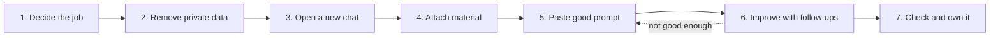

<a id="top"></a>

# 🏗️ AI Prompt Manual: 10 Use Cases for Architects & Engineers in Nepal

   

A hands-on manual for using AI chat tools (LLMs) in everyday architecture and engineering work in Nepal. Every use case has a Nepali scenario, step-by-step instructions, a **bad prompt** to avoid, a **good prompt** to copy, and a **fictional practice sample** to try it on.

> [!TIP]
> **How to use this page:** click any ▶ section to open it. Hover over a code block and click the copy icon in its top-right corner to copy a prompt.

## 📑 Contents

- [How to use this manual](#how)
- [The 6-part prompt recipe](#recipe)
- **Use cases**
  - [01. Client brief extraction](#uc01)
  - [02. Space programming (100-room hotel)](#uc02)
  - [03. Research framework (sustainable office)](#uc03)
  - [04. Meeting minutes to action tracker](#uc04)
  - [05. Preliminary cost estimation framework](#uc05)
  - [06. NBC code compliance querying](#uc06)
  - [07. Quantity surveying and material ratios](#uc07)
  - [08. Rapid concept render prompting](#uc08)
  - [09. Site coordination and voice notes](#uc09)
  - [10. Contract and tender reviewing](#uc10)
- [Quick reference: follow-up prompts](#quickref)
- [Checklist before anything leaves the office](#checklist)
- [Test yourself: 5-question quiz](#quiz)

---

<a id="how"></a>

## 🧭 How to use this manual

The same seven steps apply to every use case:



1. **Decide the job.** Know exactly what you want back: a table, a letter, a list.
2. **Remove private data.** Delete citizenship numbers, lalpurja, phone numbers and bank details before uploading anything.
3. **Open a new chat.** One job per chat keeps the answer focused.
4. **Attach your material.** Upload the email, notes, PDF or transcript, or paste the text.
5. **Paste the good prompt.** Fill in every `[bracket]` with your project's facts.
6. **Improve the answer.** Use the follow-up prompts to fix gaps.
7. **Check and own it.** Verify numbers, clauses and facts yourself before anything leaves the office.

> [!IMPORTANT]
> **Three golden rules:** AI suggests, you check, the engineer decides. Never trust AI maths without a hand check. Never paste private client documents into a free tool.

<a id="recipe"></a>

## 🧩 The 6-part prompt recipe

| Part        | Question it answers                | Example                                      |
| ----------- | ---------------------------------- | -------------------------------------------- |
| **Role**    | Who should the AI act as?          | "Act as a quantity surveyor in Nepal"        |
| **Goal**    | What exactly do you want?          | "Turn this email into a design brief"        |
| **Context** | What are the project facts?        | "Duplex, Jhamsikhel, budget NPR [__] lakh"   |
| **Action**  | What steps should it follow?       | "1) list needs 2) mark guesses 3) list gaps" |
| **Output**  | What shape should the answer take? | "A table with three columns"                 |
| **Limits**  | What must it not do?               | "Do not invent bylaw figures"                |

[⬆ Back to top](#top)

---

<a id="uc01"></a>

## 01 · Client brief extraction

**Goal:** Turn a long, messy client email into a clear list of what the client wants, what is missing, and what to ask them.  
**Best tool:** Any chat AI (ChatGPT, Claude, Gemini)

> 📍 **Nepal scenario:** A family emails a rambling 4-page note, half in Nepali and half in English, for a duplex in Jhamsikhel, Lalitpur. It mentions rooms, a puja room, parking, a rental flat on top and a rough budget.

<details>
<summary><b>🪜 Step by step</b></summary>

1. Copy the client's email into a Word or text file.
2. Delete phone numbers, citizenship details and anything personal.
3. Open a new chat in ChatGPT, Claude or Gemini.
4. Attach the file, or paste the text below the prompt.
5. Paste the good prompt and fill in the brackets.
6. Read the table. Check each requirement against the client's actual words.
7. Use a follow-up prompt to turn the questions into a polite email to the client.
8. Save the final brief in the project folder.

</details>

### ❌ Bad prompt

```text
Design this building for the client.
```

> [!CAUTION]
> **Why it fails:** AI cannot design from one vague line. You get a generic house that has nothing to do with this family.

### ✅ Good prompt (copy this)

```text
Act as an architectural programming assistant for a design firm in Kathmandu.
Analyze the attached client brief for a residential duplex in [Jhamsikhel, Lalitpur].
The email mixes Nepali and English; answer in English.
1. Extract functional, spatial and environmental requirements.
2. Separate facts (stated by the client) from assumptions (your guesses).
3. List missing information and questions for the client.
Output: a table with columns Requirement | Client's words | Fact or assumption,
then a numbered list of at most 10 questions.
Do not invent sizes, budgets or bylaw figures. If something is not stated, write "not stated".
```

<details>
<summary><b>🧪 Practice sample</b>: Fictional client email: paste it below the good prompt</summary>

```text
Subject: Ghar banaune bare

Namaste sir,
Hamro family ko lagi Jhamsikhel ma ghar banauna man cha. Plot 4.5 aana cha, east facing road.
We are 6 people: my parents, me, my wife and 2 kids (8 and 12 years).
Buwa lai knee problem cha, so ground floor ma bedroom chahincha.
Puja kotha pani chahiyo, east side ma bhaye ramro.
Top floor ma rent ko lagi 2BHK flat banaune plan cha.
Parking for 1 car and 2 scooters.
Kitchen big hunu paryo, my wife loves cooking, and a separate store room.
Budget around 2.5 crore including everything, if possible less.
Garden ali ali chahiyo.
We want a modern look but not too much glass because of dust and heat.
Can we start construction after Dashain?
Dhanyabad,
Rajesh
```

</details>

<details>
<summary><b>🔁 Follow-up prompts</b></summary>

```text
Turn the questions into a short, polite email to the client in simple English.
```

```text
Translate that email into Nepali.
```

```text
Group the requirements by floor: ground, first, top.
```

</details>

> [!WARNING]
> **Check before use:** Every requirement must trace back to the client's own words. Anything marked "assumption" needs the client's confirmation.

- [ ] I tried the bad prompt and saw why it fails
- [ ] I ran the good prompt on the practice sample
- [ ] I checked the answer before trusting it

[⬆ Back to top](#top)

---

<a id="uc02"></a>

## 02 · Space programming (100-room hotel)

**Goal:** Work out the rooms, their purpose and what should sit next to what, before you start drawing plans.  
**Best tool:** Any chat AI

> 📍 **Nepal scenario:** A boutique resort in Pokhara near Phewa Lake. The owner wants the right balance between guest areas and back-of-house (kitchen, laundry, stores, staff areas).

<details>
<summary><b>🪜 Step by step</b></summary>

1. Collect what you know: number of rooms, room types, site area, the star category the owner is aiming for.
2. Open a new chat.
3. Paste the good prompt and fill in the brackets.
4. Review the table. Delete spaces the project does not need; add any the AI missed.
5. Ask a follow-up for approximate areas, clearly marked as assumptions.
6. Compare those areas with Department of Tourism hotel standards and your past projects.
7. Use the adjacency list to sketch a bubble diagram by hand or in your CAD tool.

</details>

### ❌ Bad prompt

```text
Design a 100-room hotel.
```

> [!CAUTION]
> **Why it fails:** Far too big an ask. You get a random room list with no reasoning and no link to the site.

### ✅ Good prompt (copy this)

```text
I'm designing a 100-room hotel in [Pokhara, near Phewa Lake], aiming for a [boutique / 3-star] standard.
Develop a space-programming framework covering guest areas, back-of-house (BOH), service and accessibility.
For each space, identify:
- function
- users (guests, staff, suppliers)
- adjacencies (what must be next to it, what must be kept apart)
- open questions for the owner
Output: a table grouped by Guest / BOH / Service / Accessibility.
Do not give floor areas yet.
```

<details>
<summary><b>🧪 Practice sample</b>: Fictional owner's notes: paste them below the good prompt</summary>

```text
Project: Lakeside boutique resort, Pokhara
Plot: about 8 ropani, 200 m from Phewa Lake, gentle slope down towards the lake
Rooms: 100 total
  - 70 deluxe rooms
  - 20 lake-view suites
  - 10 family rooms (2 bedrooms each)
Facilities wanted:
  - all-day restaurant, about 120 seats
  - rooftop bar facing the lake and Machhapuchhre
  - spa with 4 treatment rooms, small gym
  - outdoor swimming pool
  - conference hall for 150 people, can split into 2
  - parking for 40 cars and 2 tourist buses
Staff: about 90 in total; staff housing for 30 on site
Owner says: "Guests should never see the laundry, deliveries or the garbage area."
Target opening: Dashain 2028
```

</details>

<details>
<summary><b>🔁 Follow-up prompts</b></summary>

```text
Now suggest approximate areas in square metres for each space, and state every assumption.
```

```text
Which spaces are most often forgotten in resort hotels?
```

```text
List the adjacencies as pairs I can draw as a bubble diagram.
```

</details>

> [!WARNING]
> **Check before use:** Areas are starting guesses only. Check them against Department of Tourism standards, fire and accessibility requirements, and your own benchmarks.

- [ ] I tried the bad prompt and saw why it fails
- [ ] I ran the good prompt on the practice sample
- [ ] I checked the answer before trusting it

[⬆ Back to top](#top)

---

<a id="uc03"></a>

## 03 · Research framework (sustainable office)

**Goal:** Plan what to study for a cooler, brighter, lower-energy building, and how you will measure success.  
**Best tool:** Any chat AI; Perplexity for sources

> 📍 **Nepal scenario:** A mid-rise office in Kathmandu. Winters are sunny and cold, the monsoon is heavy, and dust is a problem. The client wants less air-conditioning and more natural daylight.

<details>
<summary><b>🪜 Step by step</b></summary>

1. Note the basics: site location, plot orientation, number of floors, main use.
2. Open a new chat and paste the good prompt.
3. Read the framework. Remove topics that do not apply.
4. For each "data required" item, note where you will get it (DHM weather data, site survey, client).
5. Ask a follow-up for simple design ideas for each topic.
6. Check every metric against a trusted source before you commit to it.
7. Turn the final framework into your project's research checklist.

</details>

### ❌ Bad prompt

```text
Tell me about sustainable buildings.
```

> [!CAUTION]
> **Why it fails:** You get a general textbook essay, mostly written for other countries' climates.

### ✅ Good prompt (copy this)

```text
I am designing a [6]-storey office building in [Kathmandu], Nepal.
Climate notes: sunny cold winters, hot humid monsoon summers, dusty air.
Create a research framework covering orientation, daylighting, natural ventilation and building envelope.
For each topic give:
- the research question
- the data required and a likely source in Nepal
- one metric to verify the design
Output: a table. Mark anything you are unsure about as "to verify".
```

<details>
<summary><b>🧪 Practice sample</b>: Fictional site brief: paste it below the good prompt</summary>

```text
Project: Head office for an IT company, Lazimpat, Kathmandu
Plot: 1.5 ropani, long side faces south; tall building on the west side
Building: 6 storeys plus basement parking, about 250 staff, mostly open-plan offices
Client's problems in their current rented office:
  - very hot west-facing rooms in May and June
  - staff use heaters all winter
  - generator and AC bills are high
  - windows stay closed because of road dust and noise
Client wants:
  - more natural daylight and fewer lights on in the day
  - less air-conditioning
  - rooftop solar panels
  - a small terrace garden for staff
Budget: moderate; no imported high-tech facade systems
```

</details>

<details>
<summary><b>🔁 Follow-up prompts</b></summary>

```text
Suggest two low-cost design ideas for each topic, suitable for Kathmandu.
```

```text
Which of these topics has the biggest effect on energy use in this climate?
```

```text
Write this as a one-page research plan for the client.
```

</details>

> [!WARNING]
> **Check before use:** Use real local climate data from the Department of Hydrology and Meteorology (DHM), not the AI's memory. Confirm every metric with a trusted guide or an energy consultant.

- [ ] I tried the bad prompt and saw why it fails
- [ ] I ran the good prompt on the practice sample
- [ ] I checked the answer before trusting it

[⬆ Back to top](#top)

---

<a id="uc04"></a>

## 04 · Meeting minutes to action tracker

**Goal:** Turn scribbled meeting notes into a clear record of who does what, by when.  
**Best tool:** Any chat AI (most can read a photo of notes)

> 📍 **Nepal scenario:** A coordination meeting with the architect, structural and MEP consultants and the contractor. Decisions were jotted down quickly in mixed Nepali and English.

<details>
<summary><b>🪜 Step by step</b></summary>

1. Type up or photograph your handwritten notes. Most AI tools can read a clear photo.
2. Add the meeting date, project name and list of attendees at the top.
3. Open a new chat and attach or paste the notes.
4. Paste the good prompt.
5. Check each action item: correct owner, correct deadline.
6. Mark anything unclear as "to confirm" rather than guessing.
7. Email the minutes to all attendees and ask them to confirm within 48 hours.
8. Paste the action table into your project tracker.

</details>

### ❌ Bad prompt

```text
Summarize the meeting.
```

> [!CAUTION]
> **Why it fails:** You get a vague paragraph with no names, no deadlines and nothing to follow up.

### ✅ Good prompt (copy this)

```text
Convert these meeting notes into structured minutes for a construction coordination meeting.
Project: [project name]. Date: [date]. Attendees: [names and firms].
The notes mix Nepali and English; write the minutes in English.
Sections:
1. Decisions made
2. Issues raised
3. Action items as a table: Action | Responsible person | Deadline | Status
4. Pending items for the next meeting
Do not invent information that wasn't discussed. If an owner or deadline is missing, write "to confirm".
```

<details>
<summary><b>🧪 Practice sample</b>: Fictional meeting notes: paste them below the good prompt</summary>

```text
Coord mtg - Balkhu Commercial Bldg - 25 Sept - site office
Present: Ar. Sita (arch), Er. Ramesh (structure), Er. Bikash (MEP), Hari ji (contractor)

- lift pit depth issue: structure drawing ma 1.5 m, lift company le 1.8 m chahincha bhanyo.
  Ramesh to check & revise dwg
- 3rd floor slab casting next week if steel arrives. supplier bata steel delay
- MEP sleeves in beams NOT provided in 2nd floor!! Bikash not happy. core cutting?
  Ramesh to advise. no cutting without approval
- client wants to change toilet layout on 4th floor. Sita to send revised plan,
  Hari ji to give cost impact
- water tank location still not final
- next mtg 2 Oct
```

</details>

<details>
<summary><b>🔁 Follow-up prompts</b></summary>

```text
List only the actions for the structural consultant.
```

```text
Write a short cover email to send these minutes to all attendees.
```

```text
Which items are overdue compared with last meeting's minutes? (attach the old minutes)
```

</details>

> [!WARNING]
> **Check before use:** Minutes become a contract record. Have attendees confirm them before you treat them as final.

- [ ] I tried the bad prompt and saw why it fails
- [ ] I ran the good prompt on the practice sample
- [ ] I checked the answer before trusting it

[⬆ Back to top](#top)

---

<a id="uc05"></a>

## 05 · Preliminary cost estimation framework

**Goal:** Break an early budget into major cost headings and spot the risks, without pretending it is a final price.  
**Best tool:** Any chat AI + Excel

> 📍 **Nepal scenario:** A mixed-use building in Kathmandu with shops on the ground floor and flats above. The client wants a rough budget in NPR before any drawings exist.

<details>
<summary><b>🪜 Step by step</b></summary>

1. Write down what you know: floors, approximate built-up area, structure type, finish level.
2. Open a new chat and paste the good prompt with your facts.
3. Review the cost headings. Add any the AI missed (for example boundary wall, water tank, septic or sewer connection).
4. Replace every assumed rate with the current district rate or a recent quote.
5. Ask a follow-up to list the biggest cost risks.
6. Send the framework to a quantity surveyor to confirm.
7. Present it to the client as a range, clearly labelled "preliminary".

</details>

### ❌ Bad prompt

```text
What will this building cost?
```

> [!CAUTION]
> **Why it fails:** The AI may invent a single number, possibly in dollars, with no basis. Dangerous if it reaches a client.

### ✅ Good prompt (copy this)

```text
Act as a cost consultant in Nepal.
Project: [4]-storey mixed-use building in [Kathmandu], shops on ground floor, flats above,
about [____] sq ft built-up area, RCC frame, [standard / premium] finishes.
Break this brief into major cost categories.
For each category, list your rate assumptions in NPR and flag items needing QS confirmation.
Output: a table with columns Category | What it includes | Assumed rate (NPR) | Needs QS check (yes/no).
Don't present this as a final price.
```

<details>
<summary><b>🧪 Practice sample</b>: Fictional project brief: paste it below the good prompt</summary>

```text
Project: Mixed-use building near Kalanki, Kathmandu
Plot: 6 aana, road on the north side
Building: 5 storeys, RCC frame, no basement
  - Ground floor: 4 shops with shutters
  - Floors 1 to 4: two 2BHK flats on each floor (8 flats)
Approx. built-up area: 7,500 sq ft
Finishes: standard (tile flooring, aluminium windows, local sanitary fittings)
Extras: 1 passenger lift, solar water heaters, underground water tank, boundary wall
Client's expectation: "Around 3 crore total, is that enough?"
No drawings yet.
```

</details>

<details>
<summary><b>🔁 Follow-up prompts</b></summary>

```text
Which five items carry the biggest cost risk, and why?
```

```text
Show a low, likely and high range for the total.
```

```text
Write a short note to the client explaining that this is a preliminary estimate.
```

</details>

> [!WARNING]
> **Check before use:** AI rates are guesses. Use current district rates and supplier quotes, and have a quantity surveyor confirm before any figure goes to the client.

- [ ] I tried the bad prompt and saw why it fails
- [ ] I ran the good prompt on the practice sample
- [ ] I checked the answer before trusting it

[⬆ Back to top](#top)

---

<a id="uc06"></a>

## 06 · NBC code compliance querying

**Goal:** Find the relevant NBC requirements quickly, from the actual code document, with clause numbers you can check.  
**Best tool:** NotebookLM, or a Project in ChatGPT / Claude with the PDF uploaded

> 📍 **Nepal scenario:** Checking earthquake-resistant (ductile) detailing for a 4-storey RC house in Kathmandu Valley before submitting drawings for naksa pass.

<details>
<summary><b>🪜 Step by step</b></summary>

1. Download the official NBC 105 PDF from the Department of Urban Development and Building Construction (DUDBC).
2. Upload it to a tool that answers from your files: NotebookLM, or a Project in ChatGPT or Claude.
3. Paste the good prompt and fill in your building's details.
4. Open every clause the AI cites and read it yourself.
5. Ask a follow-up for a checklist you can tick off against your drawings.
6. Give the checklist to the structural engineer to review.
7. Keep a note of which clauses you checked, for the naksa pass file.

</details>

### ❌ Bad prompt

```text
Is my building code compliant?
```

> [!CAUTION]
> **Why it fails:** The AI cannot see your building. Without the code document it may quote clauses from memory that do not exist.

### ✅ Good prompt (copy this)

```text
Based only on the uploaded NBC 105 (Seismic Design of Buildings in Nepal) document,
what are the specific structural limitations and ductility requirements for a [4]-storey
[residential RC frame] building located in [Kathmandu Valley]?
Cite the specific section or clause number for every requirement.
Output: a table with columns Requirement | Clause | What to check on the drawings.
If the document does not answer something, say "not found in the document". Do not use outside knowledge.
```

<details>
<summary><b>🧪 Practice sample</b>: Fictional building details: upload the NBC 105 PDF first, then paste these below the good prompt</summary>

```text
Building: 4-storey residential house, RCC moment-resisting frame
Location: Kathmandu Valley (Budhanilkantha)
Plan size: 9 m x 12 m, 3 bays x 4 bays
Storey height: 3.0 m on every floor
Ground floor: partly open for car parking (fewer infill walls than the floors above)
Top floor: half-covered, with a water tank on the roof
Soil: not yet tested
Questions for the AI:
  1. Does the open ground floor create a soft-storey concern under NBC 105?
  2. What ductile detailing requirements apply to the beams and columns?
  3. What does the code say about the water tank load on the roof?
```

</details>

<details>
<summary><b>🔁 Follow-up prompts</b></summary>

```text
Turn this into a yes/no checklist for reviewing structural drawings.
```

```text
Explain clause [number] in plain language for a junior engineer.
```

```text
Which of these requirements are most often missed on site?
```

</details>

> [!WARNING]
> **Check before use:** AI summaries help you find clauses; they never prove compliance. The structural engineer reviews and signs off, and the municipality approves.

- [ ] I tried the bad prompt and saw why it fails
- [ ] I ran the good prompt on the practice sample
- [ ] I checked the answer before trusting it

[⬆ Back to top](#top)

---

<a id="uc07"></a>

## 07 · Quantity surveying and material ratios

**Goal:** Work out cement bags, sand and aggregate from a concrete volume, with every step shown so you can check it.  
**Best tool:** Any chat AI + a calculator or Excel

> 📍 **Nepal scenario:** Footings for a house. The contractor needs to order cement, sand and gitti from a local supplier this week.

<details>
<summary><b>🪜 Step by step</b></summary>

1. Calculate the concrete volume from the drawings yourself.
2. Confirm the grade (for example M20) and the mix ratio.
3. Open a new chat and paste the good prompt with your numbers.
4. Compare the AI's answer with the hand check below.
5. If the numbers differ, ask the AI to explain the step where they differ.
6. Add wastage (usually 2 to 5 percent, per your firm's practice).
7. Send the final table to the contractor or supplier.

</details>

### ❌ Bad prompt

```text
How much concrete materials do I need?
```

> [!CAUTION]
> **Why it fails:** No volume, grade or mix is given, so any number it returns is a guess.

### ✅ Good prompt (copy this)

```text
Act as an expert quantity surveyor in Nepal.
I have a concrete volume of [45] cubic metres for [M20] grade concrete.
Using a nominal mix ratio of [1:1.5:3], calculate the exact bags of cement (50 kg),
volume of sand (cft) and volume of aggregate (cft) needed.
Show every step with units, and state the dry volume factor and cement density you assume.
Do not include wastage; list it separately.
Format the output as a clean table for a client proposal.
```

<details>
<summary><b>🧪 Practice sample</b>: Fictional footing schedule: ask the AI to work out the volume first, then the materials</summary>

```text
Isolated footings, M20 concrete, nominal mix 1:1.5:3
  F1: 1.8 m x 1.8 m x 0.45 m deep, 8 numbers
  F2: 2.1 m x 2.1 m x 0.50 m deep, 4 numbers
Find: total concrete volume, cement bags (50 kg), sand (cft), aggregate (cft).
Show every step. No wastage.
```

</details>

<details>
<summary><b>🔑 Answer key for the practice sample</b> (try it first, then click to check)</summary>

| Item             | Calculation                             | Result                |
| ---------------- | --------------------------------------- | --------------------- |
| F1 volume        | 1.8 × 1.8 × 0.45 × 8                    | 11.66 m³              |
| F2 volume        | 2.1 × 2.1 × 0.50 × 4                    | 8.82 m³               |
| Total wet volume | 11.66 + 8.82                            | 20.48 m³              |
| Dry volume       | 20.48 × 1.54                            | 31.55 m³              |
| Cement           | 31.55 ÷ 5.5 = 5.74 m³ × 1440 kg ÷ 50 kg | 166 bags (rounded up) |
| Sand             | 5.74 × 1.5 = 8.60 m³ × 35.31            | about 304 cft         |
| Aggregate        | 5.74 × 3 = 17.21 m³ × 35.31             | about 608 cft         |

</details>

<details>
<summary><b>🧮 Hand check for the good prompt</b> (45 m³ of M20 at 1:1.5:3)</summary>

| Item       | Calculation                              | Result          |
| ---------- | ---------------------------------------- | --------------- |
| Dry volume | 45 × 1.54                                | 69.30 m³        |
| Cement     | 69.30 ÷ 5.5 = 12.60 m³ × 1440 kg ÷ 50 kg | about 363 bags  |
| Sand       | 12.60 × 1.5 = 18.90 m³ × 35.31           | about 667 cft   |
| Aggregate  | 12.60 × 3 = 37.80 m³ × 35.31             | about 1,335 cft |

Wastage is not included.

</details>

<details>
<summary><b>🔁 Follow-up prompts</b></summary>

```text
Add 3% wastage and round up to whole bags.
```

```text
Convert sand and aggregate into truckloads of [___] cft each.
```

```text
Estimate the cost using these rates: cement NPR [___] per bag, sand NPR [___] per cft, aggregate NPR [___] per cft.
```

</details>

> [!WARNING]
> **Check before use:** AI often forgets the dry volume factor or mixes up units. Always repeat the calculation by hand or in Excel before ordering.

- [ ] I tried the bad prompt and saw why it fails
- [ ] I ran the good prompt on the practice sample
- [ ] I checked the answer before trusting it

[⬆ Back to top](#top)

---

<a id="uc08"></a>

## 08 · Rapid concept render prompting

**Goal:** Write a clear description for an AI image tool to make mood-board pictures to discuss style with a client.  
**Best tool:** ChatGPT or Gemini image generation, or another image tool

> 📍 **Nepal scenario:** A contemporary house in Patan, Lalitpur, that respects the traditional Newari brick character of the neighbourhood.

<details>
<summary><b>🪜 Step by step</b></summary>

1. Decide what the picture is for: style discussion, not a final design.
2. List the key features: storeys, materials, setting, time of day, view angle.
3. Open an image tool (ChatGPT, Gemini or a dedicated image generator).
4. Paste the good prompt and fill in the brackets.
5. Generate 3 or 4 versions and pick the one closest to the idea.
6. Ask for small changes one at a time (for example, "add a wooden window frame").
7. Label every image "AI concept, not to scale" before showing the client.

</details>

### ❌ Bad prompt

```text
Make a cool house render.
```

> [!CAUTION]
> **Why it fails:** You get a generic Western villa with no link to Nepal, the site or the client.

### ✅ Good prompt (copy this)

```text
A photorealistic render of a modern [3]-storey house in [Lalitpur], Nepal.
Traditional Newari brickwork (Maapaa) on the ground floor, paired with minimalist glass
and exposed concrete above. Carved wooden window details on the street side.
Midday clear sky, lush local courtyard vegetation, narrow neighbourhood street.
Eye-level view from the street, natural colours, no people.
```

<details>
<summary><b>🧪 Practice sample</b>: Fictional client note: write your own image prompt from it, then compare with the good prompt</summary>

```text
Client note:
"Our plot is a corner plot in Patan, near the old stone water spout (dhunge dhara).
We want 3 floors and a small courtyard in the middle where the family can sit.
The outside should be brick, like the old Newari houses, with wooden windows.
We want a rooftop terrace where we can see the temples.
Please no shiny glass on the front. Inside can be modern.
Can you show us a picture in the evening when the lights are on?"

Your task: write a prompt that covers storeys, materials, courtyard, roof terrace,
time of day, camera view, and what to avoid.
```

</details>

<details>
<summary><b>🔁 Follow-up prompts</b></summary>

```text
Same house, evening light with warm interior lighting.
```

```text
Same house from the courtyard side.
```

```text
Replace the exposed concrete with lime plaster.
```

</details>

> [!WARNING]
> **Check before use:** Images are ideas, not buildable designs. Heritage-area bylaws in Patan still apply, and the client must understand the picture is only a mood board.

- [ ] I tried the bad prompt and saw why it fails
- [ ] I ran the good prompt on the practice sample
- [ ] I checked the answer before trusting it

[⬆ Back to top](#top)

---

<a id="uc09"></a>

## 09 · Site coordination and voice notes

**Goal:** Turn voice notes from a site walk into an issues list, RFIs and actions.  
**Best tool:** Any chat AI that accepts audio or text

> 📍 **Nepal scenario:** A site engineer walks a multi-storey site in Balkhu, recording quick voice notes in Nepali about honeycombing in columns and misaligned reinforcement.

<details>
<summary><b>🪜 Step by step</b></summary>

1. Record voice notes on your phone during the site walk. Say the location each time ("Grid B3, second floor column").
2. Take a photo of each issue and name it with the same location.
3. Get a transcript: many AI apps accept audio directly, or use your phone's voice-typing.
4. Open a new chat, attach the transcript, and paste the good prompt.
5. Check each item against your photos.
6. Attach the photos to the final report.
7. Send structural defects straight to the structural engineer.
8. Issue the RFIs and track the deadlines.

</details>

### ❌ Bad prompt

```text
Fix the issues mentioned in my site audio recording.
```

> [!CAUTION]
> **Why it fails:** AI cannot fix anything on site. It may also invent details that were never said.

### ✅ Good prompt (copy this)

```text
Convert this site audio transcript from [project name, Balkhu], recorded on [date], into a structured matrix.
The transcript is in Nepali; write the output in English and keep location references exactly as spoken.
1. Critical non-conformances (location, issue, severity)
2. Consultant RFIs (question, addressed to)
3. Responsible parties and deadlines
Output: three tables.
Do not assume facts not stated. If a location or owner is unclear, write "to confirm".
```

<details>
<summary><b>🧪 Practice sample</b>: Fictional voice-note transcript: paste it below the good prompt</summary>

```text
Site: Balkhu Commercial Building. Date: 28 Sept. Recorded by: Er. Suman

"Okay, ahile 2nd floor ma chu. Grid B3 ko column ma honeycombing dekhiyo, bottom ma about
300 mm samma, rod dekhiracha. Yo serious cha, structural engineer lai dekhauna parcha.
Grid C2 column ma stirrup spacing alik badi jasto cha. Tape le napda 200 mm aayo,
drawing ma confinement zone ma 100 mm cha.
3rd floor ko slab shuttering ready cha tara cover block halna baki cha. Hari ji lai bholi samma
bhannu parcha.
Staircase ko main bar alignment milena jasto cha, drawing check garnu parcha.
Ani 2nd floor slab ma curing ramro bhayeko chaina, pani halnu bhanera bhanna paryo."
```

</details>

<details>
<summary><b>🔁 Follow-up prompts</b></summary>

```text
Write RFI number [__] as a formal RFI letter to the structural consultant.
```

```text
Sort the non-conformances by severity.
```

```text
Make a checklist for the next site visit to confirm these are fixed.
```

</details>

> [!WARNING]
> **Check before use:** Confirm every item with the site team and your photos. Structural defects are decided by the structural engineer, not the AI.

- [ ] I tried the bad prompt and saw why it fails
- [ ] I ran the good prompt on the practice sample
- [ ] I checked the answer before trusting it

[⬆ Back to top](#top)

---

<a id="uc10"></a>

## 10 · Contract and tender reviewing

**Goal:** Spot unclear or one-sided clauses in a contract or tender document before you sign or bid.  
**Best tool:** Any chat AI with file upload (paid business plan for confidential documents)

> 📍 **Nepal scenario:** A sub-consultant agreement with vague milestone penalties and one-sided liability, or a public tender under the Public Procurement Act.

<details>
<summary><b>🪜 Step by step</b></summary>

1. Remove names, bank details and signatures if the document is confidential, or use a paid business plan.
2. Open a new chat and upload the contract, or paste the clauses you want reviewed.
3. Paste the good prompt.
4. Read each flagged clause in the original document yourself.
5. Ask a follow-up for suggested fairer wording.
6. Take the risk list and suggested wording to your lawyer.
7. Negotiate the changes before you sign or submit the bid.

</details>

### ❌ Bad prompt

```text
Is this contract good?
```

> [!CAUTION]
> **Why it fails:** "Good" for whom? You get a bland yes-or-no answer with no detail you can act on.

### ✅ Good prompt (copy this)

```text
Act as a legal contract specialist in AEC (architecture, engineering and construction) in Nepal.
I am the [sub-consultant / contractor]. Review the attached [agreement / tender clause text] and highlight:
1. Ambiguous milestone definitions
2. Unbalanced liability risks
3. Missing deliverable criteria
For each item, quote the clause number and explain the risk in plain language.
Format as a bulleted risk summary, most serious first.
This is a first review for discussion with my lawyer, not legal advice.
```

<details>
<summary><b>🧪 Practice sample</b>: Fictional sub-consultant agreement clauses: paste them below the good prompt</summary>

```text
Sub-Consultancy Agreement for Structural Design Services (extract)

4.2  The Sub-Consultant shall deliver the drawings in a timely manner as required by the Project.
4.5  Any delay in submission shall attract a penalty as decided by the Client.
6.1  The Sub-Consultant shall revise the design as many times as the Client requires.
7.1  The Sub-Consultant shall be fully liable for any loss, damage or delay to the Project
     arising from any cause whatsoever.
7.3  The Client's total liability under this Agreement shall not exceed NPR 50,000.
9.1  Payment shall be released after approval of the final design by the Client.
11.2 The Client may terminate this Agreement at any time without notice and without
     payment for work in progress.
```

</details>

<details>
<summary><b>💡 Hint</b> (click after you have tried)</summary>

Every clause above has a problem, from vague deadlines (4.2) to one-sided liability (7.1, 7.3). A good answer flags all seven.

</details>

<details>
<summary><b>🔁 Follow-up prompts</b></summary>

```text
Suggest fairer wording for the three most serious clauses.
```

```text
Which payment terms are missing or unclear?
```

```text
Write a polite email to the client asking to discuss these clauses.
```

</details>

> [!WARNING]
> **Check before use:** This is only a first pass. A lawyer must review the contract before you sign.

- [ ] I tried the bad prompt and saw why it fails
- [ ] I ran the good prompt on the practice sample
- [ ] I checked the answer before trusting it

[⬆ Back to top](#top)

---

<a id="quickref"></a>

## ⚡ Quick reference: follow-up prompts for any use case

```text
What did you miss or assume? List it, then give a corrected version.
```

```text
Show every step of your working, with units.
```

```text
Which parts of your answer are you least sure about?
```

```text
Make it shorter and simpler, for a client with no technical background.
```

```text
Translate this into Nepali.
```

```text
Cite the clause or page for every requirement, using only the uploaded document.
```

<a id="checklist"></a>

## ✅ Checklist before anything leaves the office

- [ ] Personal and confidential details were removed before uploading.
- [ ] Every number was checked by hand or in Excel.
- [ ] Every code clause was opened and read in the original document.
- [ ] Assumptions are clearly marked for the client or team.
- [ ] A qualified person reviewed it: QS for costs, structural engineer for structure, lawyer for contracts.
- [ ] The project file notes which AI tool was used, the date and who checked it.

<a id="quiz"></a>

## 🎯 Test yourself: 5-question quiz

**Q1.** Which prompt will give a better meeting record?

- **A:** "Summarize the meeting."
- **B:** "Convert these notes into decisions, issues, action items with owner and deadline. Do not invent anything."

<details>
<summary>Show answer</summary>

**B.** It says exactly what to produce, in what shape, and what not to do. A gives a vague paragraph.

</details>

**Q2.** The AI tells you "NBC 105 clause 5.4.2 requires X". What should you do first?

<details>
<summary>Show answer</summary>

**Open NBC 105 and read clause 5.4.2 yourself.** The AI may quote a clause that does not exist or says something different.

</details>

**Q3.** Which of these should you never paste into a free AI tool: a public NBC PDF, a client's lalpurja, or your own meeting notes with personal details removed?

<details>
<summary>Show answer</summary>

**The client's lalpurja.** Personal documents such as lalpurja, citizenship and bank details must stay out of free tools.

</details>

**Q4.** For 45 m³ of M20 (1:1.5:3) the AI says you need about 236 bags of cement. What mistake has it probably made?

<details>
<summary>Show answer</summary>

**It forgot the dry volume factor (1.54).** 45 ÷ 5.5 × 1440 ÷ 50 ≈ 236 bags; with the factor it is about 363 bags.

</details>

**Q5.** A drawing prepared with AI help has an error that causes a problem on site. Who is responsible?

<details>
<summary>Show answer</summary>

**The registered engineer or architect who signed it.** AI cannot hold a licence, so responsibility stays with the professional.

</details>

---

> [!NOTE]
> All samples in this manual are **fictional** and for practice only. Model names and features of AI tools change often. This manual is for learning and is not legal, structural or cost advice. Always confirm with qualified professionals and the original documents.

**AI suggests · You check · The engineer decides.**

[⬆ Back to top](#top)
